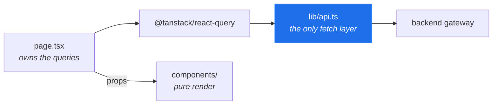

# trading-system-with-ai — frontend

> ## ⚠️ Research software. Not financial advice.
>
> This project displays market research. **It is not a recommendation to buy
> or sell anything**, it is not financial, investment, legal or tax advice, and
> its authors are not registered investment advisers.
>
> **Options trading carries a substantial risk of loss** and is not suitable
> for every investor. Nothing here has been reviewed by any regulator. Figures
> shown may be wrong — this software may contain defects.
>
> **If you connect a broker, you are placing the trades and you bear the
> losses.** Execution ships disabled and every order requires explicit human
> approval.
>
> Licensed under [Apache 2.0](LICENSE) and provided **"AS IS", without
> warranties or conditions of any kind**. Full text: [NOTICE](NOTICE).

---

Next.js (App Router) + TypeScript. The research surface for a platform that
analyses **options trading around scheduled catalysts** — earnings, CPI, GDP,
FOMC decisions.

The backend is a separate repository:
**[trading-system-with-ai/services](https://github.com/trading-system-with-ai/services)**,
which is also where the project overview, the architecture and the safety
model are documented. This file is about how the frontend is built and the
rules it holds itself to.

## Four dependencies

`next`, `react`, `react-dom`, `@tanstack/react-query`. That is the whole
runtime dependency list.

There is **no chart library**, no component framework and no CSS framework.
Charts are hand-written inline SVG; styling is one stylesheet of CSS custom
properties. This is deliberate: a financial chart has to be able to refuse to
draw — a missing value must render as a *gap*, not as a zero — and general
chart libraries make that the awkward path. Writing the SVG directly makes the
honest behaviour the easy one.

## Data flow



The browser talks to **one** origin: the gateway. It never holds a vendor key
and never reaches Alpaca, an LLM or Polymarket directly. `NEXT_PUBLIC_API_BASE`
is the only public env var, and it is a URL, not a secret.

Components receive data as props and render it. A component that needed its own
query would let two tabs disagree about the same event, so the page owns the
fetching and shares one result.

## Polling is opt-in

Every query used to refetch on a 15-second timer. On a long research page that
replaced the content under the reader's cursor several times a minute — and
took their scroll position with it — to re-fetch stored bytes that had not
changed.

[`lib/query-policy.ts`](lib/query-policy.ts) inverts the default. Polling is
**off** unless the query key is named as live data:

| Polls | Static |
|---|---|
| quotes, positions, orders | evidence bundles, analyses |
| broker/trading status | prediction markets, macro, news |
| portfolio risk, trading pool | event history, replays, the catalyst feed |

An unrecognised key is static by design — the failure mode is "press refresh",
not "the page moved while I was reading".

## Charts

Each chart component's docstring lists its encoding decisions **as honesty
rules**, and tests pin them. The recurring ones:

- **Polarity is geometry, not colour.** Above a full-weight zero line rose,
  below it fell. Colour encodes identity or horizon instead — green/red would
  assert *good/bad*, and whether a fall is bad depends on a position the
  platform does not know you hold.
- **A missing value draws nothing.** Never a zero-height bar: "not measured"
  and "did not move" are opposite claims.
- **Axes are not fitted to flatter the data.** Prediction-market bars are
  always 0–100¢; reaction bars are symmetric about zero with a floor. Four
  cheap contracts must look cheap, and a quiet quarter must not look dramatic.
- **Hover adds, never carries.** Everything drawn is also printed nearby, so a
  reader who never points at the chart loses detail, not meaning.
- **One shared palette** (`#4493f8` / `#c08a1e`), so neighbouring charts on one
  page do not teach two colour languages.

| Component | Shows |
|---|---|
| `MacroReactionChart` | cross-asset moves around the previous macro print |
| `ReactionHistoryChart` | signed 1d/5d stock moves after each prior event |
| `ImpliedVsActualChart` | what options charged vs what the stock did |
| `PredictionMarketBars` | every bracket of one distribution on a fixed axis |
| `PriceMoveTimeline` | days a contract repriced sharply |
| `EvidenceCoverageMap` | which parts of an event have data at all |

## Empty states

The backend distinguishes "never researched", "researched and found nothing",
"provider unreachable" and "not configured". The UI renders **four different
sentences**, and prints the server's reason verbatim rather than paraphrasing
it — the wording is part of the audit record.

Absent renders as "unknown", never as `0` or `—`.

## Bilingual

Every user-facing string goes through `useT("English", "中文")`. There is no
translation file to drift out of sync: both languages sit at the call site, so
adding one without the other does not typecheck.

## Layout

```
app/                    routes (App Router)
  catalysts/[eventId]/  the main research screen
  watchlist/[ticker]/   single-name depth
  providers.tsx         QueryClient + polling policy
components/
  catalysts/            event tabs and charts (the largest area)
  watchlist/ options/ risk/ backtests/ dashboard/ settings/ shared/
lib/
  api.ts                the only fetch layer
  types*.ts             wire types, matching the backend exactly
  query-policy.ts       which queries may poll
  i18n.tsx              useT
```

## Development

Start the backend first (see its README), then:

```bash
npm install
cp .env.example .env.local     # points at http://localhost:8000
npm run dev                    # http://localhost:3000

npx vitest run                 # ~950 component tests
npx tsc --noEmit               # types must be clean
```

**A note on wire types.** TypeScript cannot catch a field name that does not
exist on the wire — it reads `undefined` and renders an empty panel. Types in
`lib/types*.ts` must match the backend's JSON exactly, and the safest way to
confirm is to `curl` the endpoint and compare, rather than to infer from the
Python.

## Security

Found a vulnerability? See [SECURITY.md](SECURITY.md) — please report
privately rather than opening a public issue.

**The gateway ships with no authentication.** It assumes localhost. Put your
own auth in front of it before exposing it to a network.

## License

[Apache 2.0](LICENSE). See [NOTICE](NOTICE) for the risk disclaimer.
